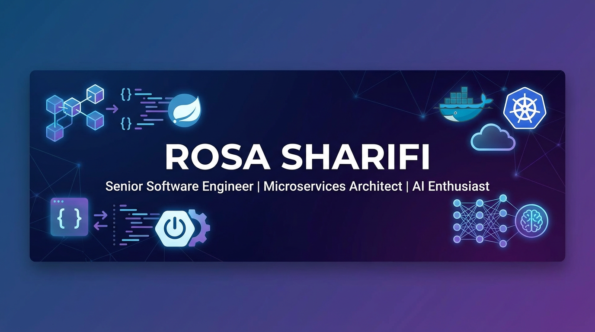

# 👋 Hi, I'm Rosa Sharifi

### Senior Software Engineer | Microservices Architect | AI Enthusiast

---

## 🚀 About Me

I'm a **Senior Software Engineer** with **5+ years** of experience building **scalable microservices** and **distributed systems** for mission-critical financial platforms. Currently working at **Behpardakht Mellat**, where I architect systems processing **100,000+ daily transactions** serving 50+ companies.

🎓 **Currently:** Applying for Master's programs in **Software Engineering** and **Computer Vision & Data Science** in the Netherlands

🔭 **Focus Areas:** Microservices Architecture, Cloud-Native Technologies, Event-Driven Systems, AI/ML

🌱 **Learning:** Computer Vision, Deep Learning, Python for AI, Advanced System Design

---

## 💼 Featured Projects

These are my primary projects where I've contributed as a core developer and architect:

### 🏋️ [Join2Gym](https://github.com/join2gym) - Smart Gym Management Platform
> **Role:** Backend Architect & Lead Developer

A comprehensive gym and fitness management system with intelligent scheduling, member management, and workout tracking capabilities.

**Tech Stack:** `Spring Boot` `Microservices` `PostgreSQL` `Redis` `Docker` `Kubernetes`

**Key Features:**
- 💪 Member management and subscription handling
- 📅 Class scheduling with capacity management
- 💳 Payment processing and invoicing
- 📊 Analytics dashboard for gym owners
- 📱 Mobile-friendly REST APIs
- 🔐 OAuth2 authentication with Keycloak

**Architecture Highlights:**
- Event-driven microservices architecture
- CQRS pattern for read/write optimization
- Real-time notifications with WebSockets
- Scalable to handle thousands of concurrent users

[🔗 View Organization →](https://github.com/join2gym)

---

### 🏥 [PhysiotherapyAI](https://github.com/physiotherapy-ai) - AI-Powered Rehabilitation Platform
> **Role:** Full-Stack Developer & ML Integration Specialist

An innovative platform leveraging AI to provide personalized physiotherapy exercises and progress tracking for patients.

**Tech Stack:** `Spring Boot` `Python` `TensorFlow` `Computer Vision` `MongoDB` `RabbitMQ`

**Key Features:**
- 🤖 AI-driven exercise recommendation engine
- 📹 Computer vision for posture analysis
- 📈 Progress tracking with data visualization
- 👨‍⚕️ Therapist-patient communication portal
- 📱 Mobile app integration
- 🔒 HIPAA-compliant data handling

**Innovation:**
- Machine learning models for exercise personalization
- Real-time pose estimation using OpenCV
- Predictive analytics for recovery timelines
- Integration of wearable device data

[🔗 View Organization →](https://github.com/physiotherapy-ai)

---

### 🔐 [AuthServer Projects](https://github.com/AuthServerProjects) - Enterprise Authentication Infrastructure
> **Role:** Security Architect & Core Developer

A robust, enterprise-grade authentication and authorization server supporting multiple protocols and SSO capabilities.

**Tech Stack:** `Spring Security` `OAuth2` `OpenID Connect` `JWT` `Keycloak` `Redis` `PostgreSQL`

**Key Features:**
- 🔑 Multi-tenant authentication server
- 🌐 Single Sign-On (SSO) support
- 🛡️ OAuth2 & OpenID Connect protocols
- 👥 Role-based access control (RBAC)
- 🔄 Token refresh and revocation
- 📊 Audit logging and monitoring

**Security Highlights:**
- Industry-standard encryption (AES-256, RSA)
- Rate limiting and brute-force protection
- Multi-factor authentication (MFA)
- Integration with LDAP/Active Directory
- Compliance with OWASP security standards

[🔗 View Organization →](https://github.com/AuthServerProjects)

---

## 🛠️ Technical Skills

### **Languages**

### **Frameworks & Libraries**
`Spring Boot` `Spring Cloud` `Spring Security` `Hibernate` `JPA` `Microservices` `REST APIs`

### **Cloud & DevOps**
`Docker` `Kubernetes` `OKD (OpenShift)` `CI/CD` `GitHub Actions` `Maven` `Git`

### **Databases**
`PostgreSQL` `Oracle` `MongoDB` `Redis` `ElasticSearch`

### **Messaging & Streaming**
`Apache Kafka` `RabbitMQ` `Event-Driven Architecture`

### **Testing**
`JUnit` `Mockito` `Integration Testing` `TDD` `Test Coverage (JaCoCo)`

### **Architecture & Design**
`Microservices` `Design Patterns` `SOLID Principles` `Clean Code` `DDD` `CQRS` `Event Sourcing`

---

## 💡 Professional Experience Highlights

### **Behpardakht Mellat** | Senior Software Engineer
*August 2024 - Present*

- 🏦 Architected **SidePay** payment solution serving **500+ gas stations** with **30% faster** transaction processing
- 💼 Contributed to **Comprehensive Wallet** platform processing **100,000+ daily transactions**
- ☁️ Deployed microservices on **OKD (Kubernetes)** with **Kafka** and **RabbitMQ** for event-driven architecture
- 🎰 Designed secure lottery system for **10,000+ POS operators**

### **Fanap Co** | Java Developer
*August 2020 - July 2024*

- 📦 Developed **Purchasing Management** module for comprehensive ERP system with **20+ modules**
- 🔐 Implemented **OAuth2/OpenID Connect** authentication with **Keycloak** for multi-tenant architecture
- 🔄 Designed vendor portal with secure API integration enabling real-time data synchronization

---

## 🎯 Current Goals

- 🎓 Pursuing **Master's degree in Software Engineering & Data Science** in Europe
- 🤖 Expanding expertise in **AI, Machine Learning & Computer Vision** technologies
- 📚 Deepening knowledge in **Deep Learning algorithms** and **computer vision applications**
- 🌍 Contributing to **open-source projects** in AI and cloud-native ecosystems
- 👩‍🏫 Mentoring aspiring software engineers, especially women in technology

---

## 📫 Let's Connect

I'm always interested in collaborating on innovative projects, especially in:
- 🏗️ **Microservices Architecture** and distributed systems
- 🤖 **AI/ML Applications** in real-world scenarios
- 🔐 **Security & Authentication** solutions
- ☁️ **Cloud-Native Technologies** and DevOps practices

Feel free to reach out:

---

### ⭐ "Building robust systems today for a smarter tomorrow"

*Passionate about clean code, scalable architecture, and continuous learning*

